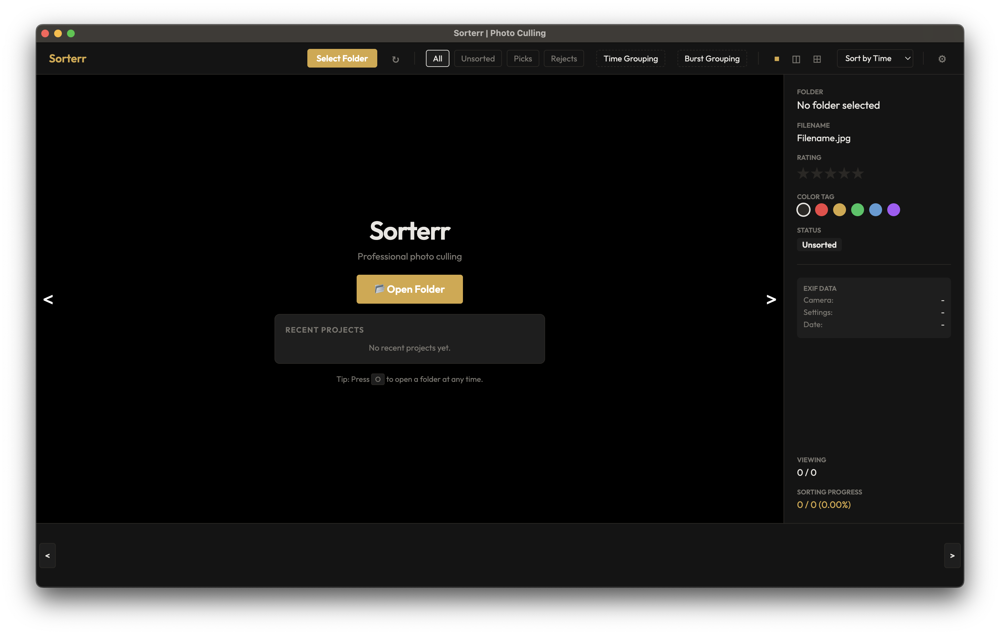

# Sorterr

Professional photo culling, built for speed.

Sorterr is a fast, keyboard-driven desktop application designed for sorting and culling large photo libraries. It runs entirely locally with no cloud dependencies and supports all major image formats, including RAW files.

**Browser Requirement:** Sorterr requires a modern web browser (Brave, Chrome/Chromium, or Firefox) to be installed on your system. It leverages the browser's rendering engine to power its user interface while functioning as a standard local desktop application.

### Key Features
- Instant image navigation with a browser-side preload cache.
- Native support for RAW formats (CR2, NEF, ARW, DNG, ORF, RW2, RAF, CR3).
- Fast one-key culling to pick, reject, or restore images.
- Automatic Time and Burst grouping for rapid-fire sequences.
- EXIF metadata panel and customizable keyboard shortcuts.

---

## Downloads

Visit the [releases page](https://github.com/CalvinistKlein/Sorterr-Image-Management/releases) and grab the latest version to try it out.

---

## Detailed Summary

### Workflow and Culling
Sorterr operates directly on your local file system. Picked images are moved to a Picks subfolder, while rejected images are sent to a Rejects subfolder. This process is non-destructive and fully reversible. You can rate images from 1 to 5 stars and assign color tags using keyboard shortcuts. Metadata is saved locally in a hidden configuration file to ensure your existing photo directories remain uncluttered.

### Layout and Organization
The application provides multiple viewing options, including single-image, split-view, and grid layouts. To handle large directories efficiently, thumbnails are generated in the background. Sorterr also includes advanced sorting features like Time Grouping and Burst Grouping, allowing you to automatically organize images based on capture intervals.

### Technical Architecture
Built using Python and Eel, Sorterr creates a seamless bridge between a Python backend and a lightweight browser-based frontend. It utilizes a dual-server architecture: a Flask server to serve local image assets and an Eel server to handle application logic. This setup ensures high performance and near-zero loading delays when navigating between large RAW files.

### Installation from Source
If you prefer to run Sorterr from the source code instead of using a pre-compiled binary:

1. Clone the repository and navigate to the project directory.
2. Create and activate a Python virtual environment (requires Python 3.10+).
3. Install dependencies using `pip install -r requirements.txt`.
4. Run the application with `python main.py`.

To build your own standalone executable, use the provided `build.sh` (Linux/macOS) or `build.bat` (Windows) scripts.

### Keyboard Controls
Navigation and culling are designed around efficiency. By default, use the arrow keys or WASD to move between images, pick, or reject. Star ratings and color tags can be quickly applied using the number row. All navigation keybinds can be remapped in the settings panel to suit your specific workflow.

### License
Sorterr is open-source software released under the MIT License.
